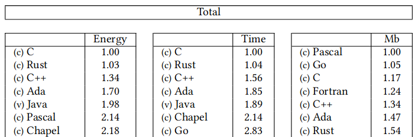

# 简介

## 什么是 Rust

Rust 是一种现代的高级编程语言. 性能上与较为底层的 C/C++ 相当, 但 Rust 却有更高的抽象程度, 常与 C++, go, Java, C# 等语言相比较.

Rust 诞生之后得到了广泛的关注和业界的厚爱, 其使命可以说是吸取过去几十年来各类编程语言的优点和教训, 成为当代基础软件设施 (比如操作系统, 编译器, Web 服务, 数据库等) 的开发语言. 

在未来, 越来越多的软件都会用 Rust 重写, 以获得更好的性能, 更好的安全性, 更好的可维护性. 并且 Rust 由于其基于 LLVM 的特点, 可以在 WebAssembly, 嵌入式等更多的领域发挥威力.

这里列一些我接触过的好用的 Rust 项目

- [fd](https://github.com/sharkdp/fd) 命令行查找工具, 比 `find` 更快更简单
- [bat](https://github.com/sharkdp/bat) 复刻 cat, 但有语法高亮和 Git 集成
    ```shell
    alias cat='bat -pp'
    alias less='bat -p'
    ```
- [starship](https://github.com/starship/starship) 美观的终端插件, 非常快, 适配多种终端
- [mdbook](https://github.com/rust-lang/mdBook) 用 Markdown 生成你现在看到的页面

## 为什么是 Rust

- 好用的工具链
- 仅次于 C 的资源效率, 参见 [Energy Efficiency across Programming Languages](https://greenlab.di.uminho.pt/wp-content/uploads/2017/10/sleFinal.pdf)  (Python 是 70 多, 直接被截掉了!)
- 内存安全
- 高级抽象

今天, 我们通过和 C/C++ 对比, 讲讲 Rust 所具有的众多优势.

例如, C/C++ 没有完善的包管理系统, 而 Rust 的工具链是我目前见过最好的, 考虑这样的场景:

1. A 写了一个 C/C++ 库, 假设称为 [spdlog](https://github.com/gabime/spdlog) (这个库真的存在并且很好用), 并且发布在了 GitHub 上
2. B 希望使用 A 这个库, 于是 B 需要翻阅 A 写的指南. 假设 A 使用的构建系统是 cmake, 那么 B 大概需要写这样一些东西:
    ```cmake
    // CMakeLists.txt
    include(FetchContent)

    FetchContent_Declare(
    spdlog
    GIT_REPOSITORY https://github.com/gabime/spdlog.git
    GIT_TAG        v1.14.1
    )

    FetchContent_MakeAvailable(spdlog)

    add_executable(main src/main.cc)
    target_link_libraries(main spdlog)
    ```
3. 理想情况下, B 就可以跑起来 A 这个库了, 但假如 B 自己用的构建系统是 GNU make, 那就糟了, (是的, C/C++ 有多种构建系统), B 需要研究一番 A 的 spdlog 是怎么组织的, 然后自己写一个构建配置. (当然实际上由于 spdlog 是一个只用头文件实现的库, 所以 B 大概只需要把该头文件放入自己的项目目录里就行, 但这种解决方式一点也不优雅, 如果上游 spdlog 更新了又该怎么办呢?)

对比 Rust, Rust 的包管理系统 Cargo 会怎么做呢? 只需要一行

```toml
[dependencies]
# 其他依赖
log = "0.4.21"
```

这就可以将名为 log 的库添加到你的项目中, Cargo 会自动下载并合适地编译这个库, 你现在就可以在代码中引用它了.

加入你想更新所有依赖版本, 只需要 `cargo update` 就行了, 如果有比 `0.4.21` 更高的版本, Cargo 会自动下载更新. 相比 Cargo, C/C++ 的包管理系统就显得非常原始了.

这里插一句题外话, 介绍一下[语义化版本号](https://semver.org/lang/zh-CN/), 一个版本号由三个数字组成, 分别是 `主版本号.次版本号.修订号`

简单来说

- 主版本号表示不兼容的变动: 旧有功能, 接口命名变了, 某个被标记为弃用的在这次更新中被删掉了, 被合并到其他接口了, 诸如此类.
- 次本号表示兼容的变动: 比如添加了一个功能, 原有功能的行为还是一样的, 再比如标记某个接口被弃用了 (deprecated), 但实际上这个接口还是能用的.
- 修订号表示修复了一些 bug, 更换了一些实现, 比如某个功能内部采用更高效的二分查找, 但没有添加新的功能.

此外, Rust 在执行效率上也是非常强大, 这得益于 LLVM 的优化以及 Rust 经常做静态分发, 没有垃圾回收, 对 LLVM 和 Rust 感兴趣的可以看[这篇文章](https://rustmagazine.github.io/rust_magazine_2021/chapter_12/llvm-infrastructure-and-rust.html).

## 可能有用的资料

- [The Rust Programming Language](https://doc.rust-lang.org/book/) 经典官方教程, 值得信赖
  - [The Rust Programming Language 中文版](https://rustwiki.org/zh-CN/book/)
  - [The Rust Reference](https://doc.rust-lang.org/reference/) 官方参考, 不是教学用的, 但很有价值
- [Rust 中文社区](https://rustcc.cn/) 关注招聘信息和各种有趣的每日新闻, 建议用 RSS 订阅, 虽然也有微信公众号
- [Rust 语言圣经](https://course.rs/about-book.html) 价值不只在于教程, 作者诸多实践经验值得一读
- [贵系 Rust 暑培](https://summer23.net9.org/backend/rust/) 他们讲 Rust Web 生态的那一个帖子也值得一看
- [Rust 程序设计训练](https://lab.cs.tsinghua.edu.cn/rust/) 可以获得往年的幻灯片, 讲了很多概念
- [Rust 练手项目](https://practice-zh.course.rs/elegant-code-base.html)
- [Rust Boom](https://rust-boom.github.io/rust-boom/) 一个资源集合, 如果上面这些还不够多, 你可以去这里找找
